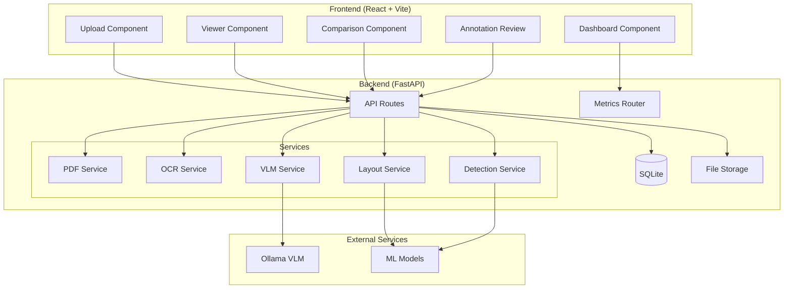
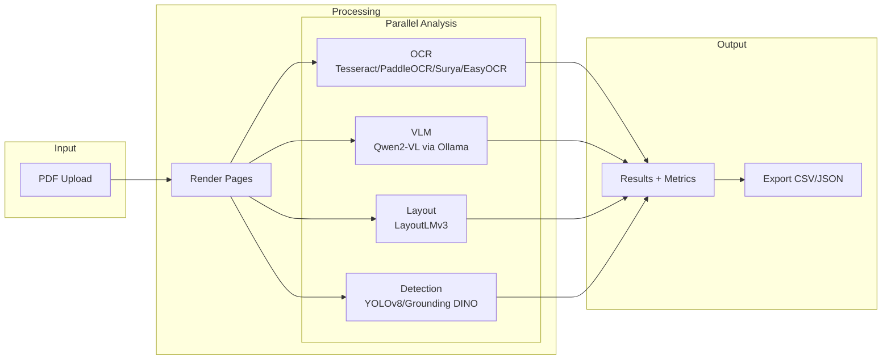
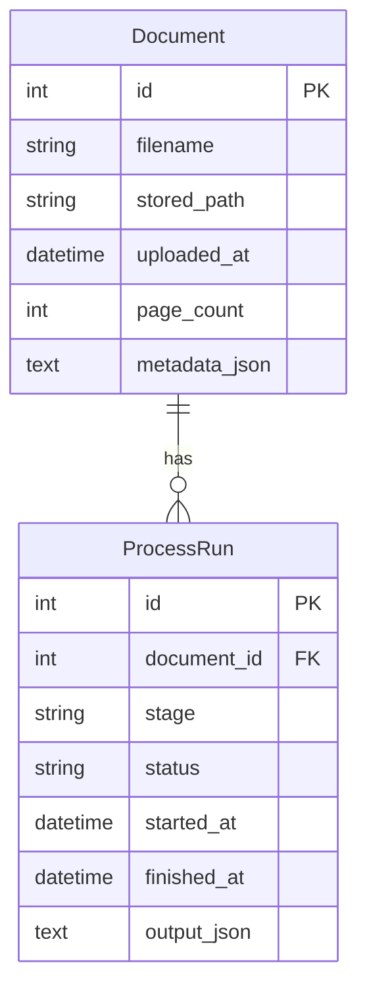
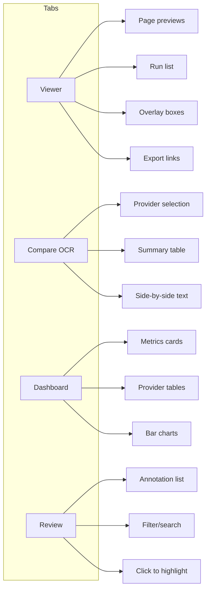
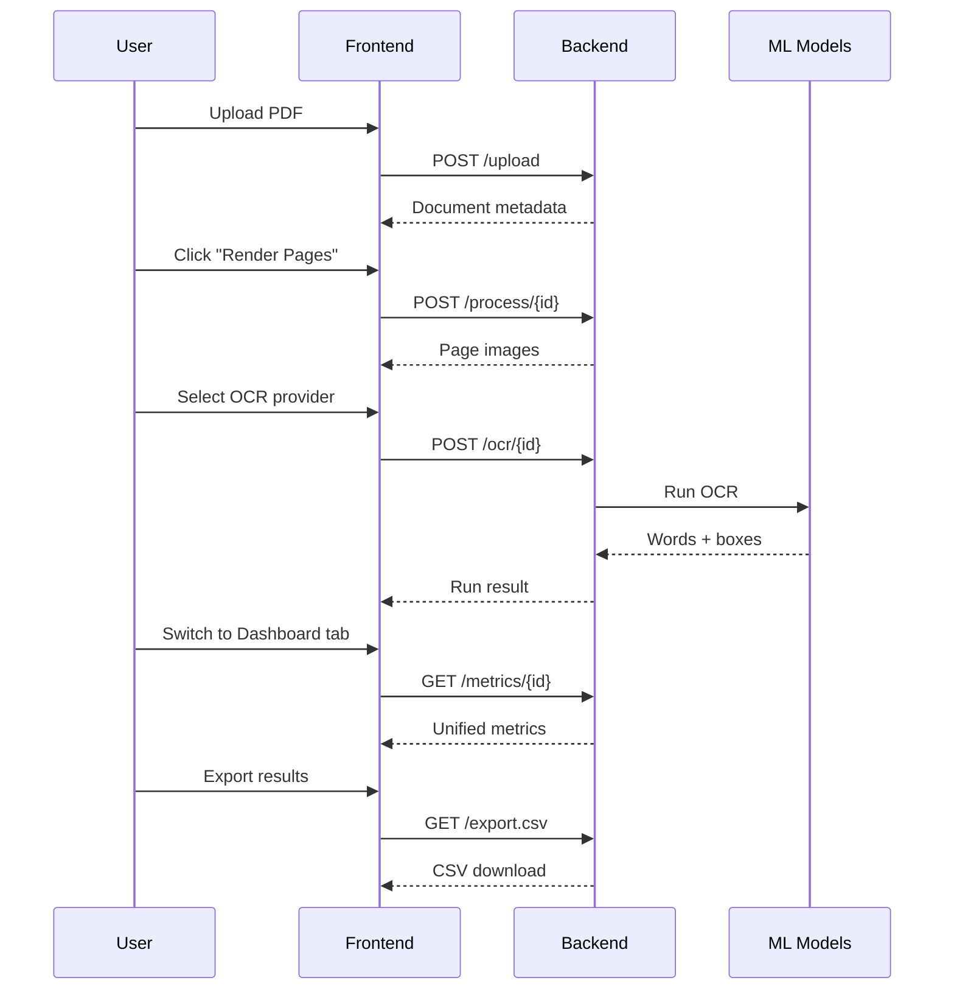

# Construction Vision

Evaluation harness for AI vision methods on construction drawing PDFs. Compare OCR providers, VLMs, layout analysis, and object detection side-by-side.

## Architecture



## Processing Pipeline



## Data Model



## UI Tabs



## Quick Start

### Backend

```bash
python -m venv venv
source venv/bin/activate
pip install -r requirements.txt
uvicorn backend.app.main:app --reload
```

### Frontend

```bash
cd frontend
npm install
npm run dev
```

### Ollama (for VLM)

```bash
ollama pull qwen2-vl:7b
```

## API Endpoints

| Method | Endpoint | Description |
|--------|----------|-------------|
| POST | `/upload/` | Upload PDF |
| POST | `/process/{id}` | Render pages |
| POST | `/ocr/{id}` | Run OCR |
| POST | `/vlm/{id}` | Run VLM |
| POST | `/layout/{id}` | Run layout analysis |
| POST | `/detect/{id}` | Run detection |
| GET | `/results/{id}` | Get all runs |
| GET | `/metrics/{id}` | Get unified metrics |
| GET | `/metrics/{id}/compare/{stage}` | Compare providers |
| GET | `/results/{id}/export.csv` | Export CSV |
| GET | `/results/{id}/export.json` | Export JSON |

## Supported Providers

### OCR
- **Tesseract** - Classic OCR with LSTM engine
- **PaddleOCR** - Fast, accurate, good CJK support
- **EasyOCR** - Simple API, 80+ languages
- **Surya** - Modern, layout-aware

### VLM
- **Qwen2-VL** (via Ollama) - Multi-page support with `max_pages` option

### Layout
- **LayoutLMv3** - Document structure understanding

### Detection
- **YOLOv8** - Fast object detection
- **Grounding DINO** - Open-vocabulary detection

## Environment Variables

### Frontend
| Variable | Description |
|----------|-------------|
| `VITE_API_BASE` | API base URL |
| `VITE_BASE` | Vite base path (e.g., `/plan-viz/` for GitHub Pages) |

### Backend
| Variable | Description |
|----------|-------------|
| `ALLOWED_ORIGINS` | Comma-separated CORS origins |
| `LAYOUTLMV3_MODEL` | LayoutLMv3 model name |
| `GROUNDING_DINO_MODEL` | Grounding DINO model name |
| `YOLO_MODEL_PATH` | YOLOv8 model path |
| `RESULTS_RETENTION_DAYS` | Auto-cleanup for old artifacts |

## Project Structure

```
plan-viz/
├── backend/
│   └── app/
│       ├── main.py
│       ├── db.py
│       ├── models.py
│       ├── schemas.py
│       ├── routers/
│       │   ├── upload.py
│       │   ├── process.py
│       │   ├── ocr.py
│       │   ├── vlm.py
│       │   ├── layout.py
│       │   ├── detect.py
│       │   ├── results.py
│       │   └── metrics.py
│       ├── services/
│       │   ├── pdf_service.py
│       │   ├── ocr_service.py
│       │   ├── vlm_service.py
│       │   ├── layout_service.py
│       │   └── detection_service.py
│       └── data/
│           ├── uploads/
│           ├── pages/
│           └── results/
└── frontend/
    └── src/
        ├── App.jsx
        └── components/
            ├── Upload.jsx
            ├── Viewer.jsx
            ├── Comparison.jsx
            ├── Dashboard.jsx
            └── AnnotationReview.jsx
```

## Development Workflow



## Notes

- `pdf2image` requires Poppler on your system
- Page images served from `/files` endpoint
- Run outputs persisted as JSON in `backend/app/data/results`
- Frontend is a static Vite app suitable for GitHub Pages
- Backend requires separate hosting (GPU optional but recommended)
